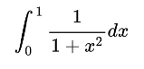

# Estimating Pi by Monte Carlo Integration #1

In this assignment, a file named assignment.py is used to estimate the value of pi by monte carlo integration with the integral below:

This integral will evaluate to `pi / 4`. In assignment.py, a function `estimate_pi` is established and takes in the argument, `n_samples` (integer). `n_samples` is the number of points (x, y) to be generated from 0 to 1. If the `y < (1 / (1 + x^2))`, then the point is considered under the curve. Using this method, we can generate a large amount of points and calculate the total area under the curve by calculating `points_under_curve / n_samples`. This evaluates to `pi / 4`, so the result from the calculation must be multiplied by 4.

Test case #1 checks to see if the function works to evaluate to an area of pi after using 10000 points. This should result in a close answer (but not exact) to pi, therefore the math.isclose() function is used.

Test case #2 checks to see if a point which is generated under the curve evaluates to under the curve. Here I utilized random.seed() to generate a predictable random number generator. The first point generated here will always be under the curve, and when this happens, the calculated area is 1 and then after multiplying by 4, the final result should be 4.

Test case #3 checks to see if a point which is generated outside of the curve is not evaluated to be under the curve. I utilized the same method in the previous test case, except this first point will be generated outside of the curve. The program then evaluates to 0 because the 1 sample that is generated is not under the curve.

Each of these test cases demonstrates that the code is working as intended. The test cases check to see if a point generated inside or outside of the curve will be evaluated correctly, and they also check if a high number of samples evaluates closely to pi.